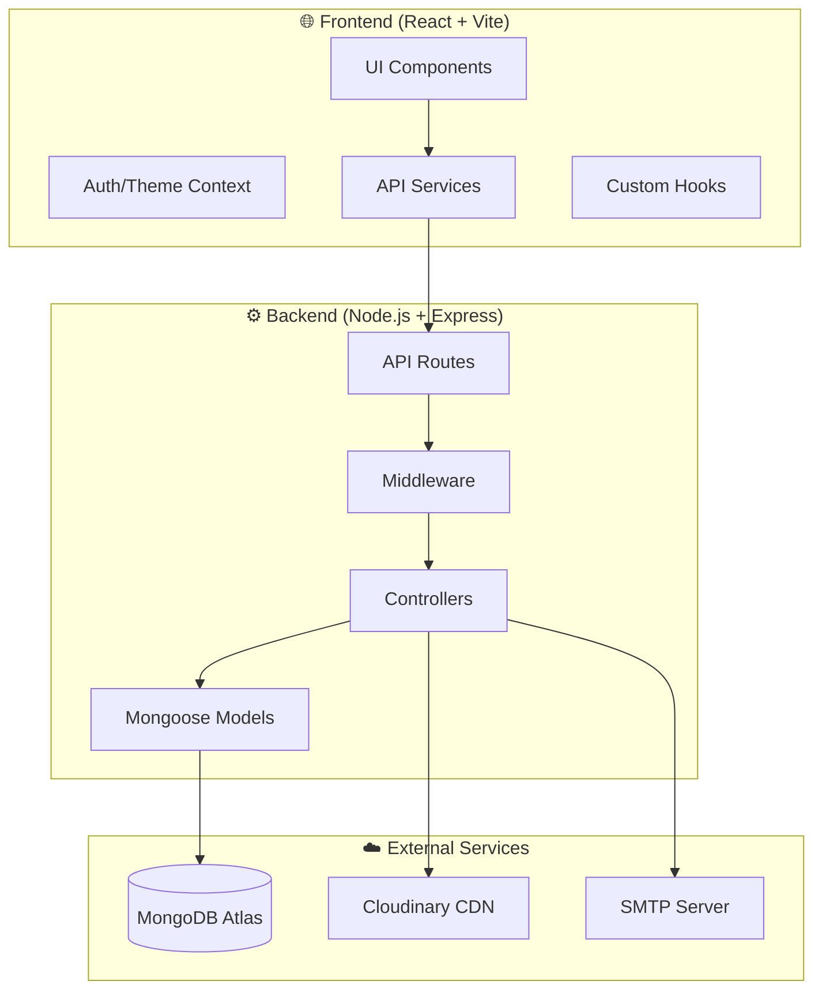
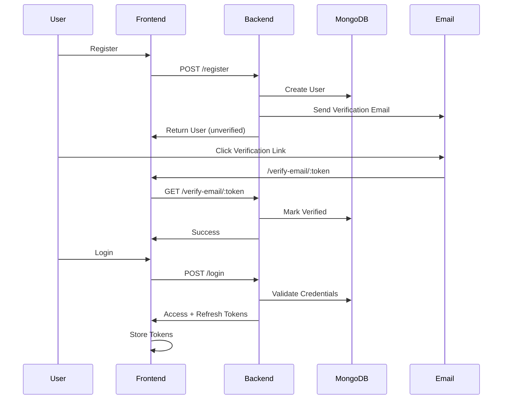
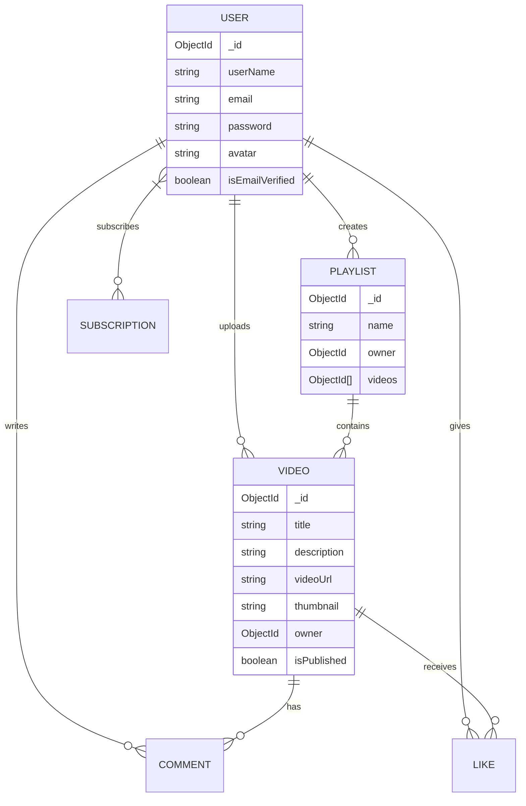

<p align="center">
  
  
  
  
</p>

<h1 align="center">🎬 Streamify</h1>
<p align="center"><strong>Modern Video Streaming Platform</strong></p>
<p align="center">A full-stack YouTube-like platform built with React, Node.js, and MongoDB</p>

---

## 📸 Screenshots

> Add your screenshots here by replacing the placeholders below

|                          Home Page                          |                           Video Player                           |                           Profile                            |
| :---------------------------------------------------------: | :--------------------------------------------------------------: | :----------------------------------------------------------: |
|  |  |  |

---

## ✨ Features

<table>
<tr>
<td width="50%">

### 🎥 Video Features

- ✅ Upload videos (up to 2GB)
- ✅ Auto video compression (FFmpeg)
- ✅ Custom video player
- ✅ Thumbnails & metadata
- ✅ Like, comment, share
- ✅ Watch history tracking
- ✅ Watch later queue
- ✅ Playlists management

</td>
<td width="50%">

### 👤 User Features

- ✅ JWT Authentication
- ✅ Email verification
- ✅ Password reset via email
- ✅ User profiles & avatars
- ✅ Channel subscriptions
- ✅ Creator dashboard
- ✅ Video management

</td>
</tr>
<tr>
<td>

### 🛡️ Security

- ✅ Rate limiting
- ✅ Helmet security headers
- ✅ Token refresh mechanism
- ✅ Input validation
- ✅ XSS protection

</td>
<td>

### ⚡ Performance

- ✅ Lazy loading (React.lazy)
- ✅ Code splitting
- ✅ GZIP compression
- ✅ Cloudinary CDN
- ✅ Optimized queries

</td>
</tr>
</table>

---

## 🏗️ Architecture



---

## 🔄 Authentication Flow



---

## 📁 Project Structure

```
streamify/
├── 📂 frontend/                    # React + Vite Application
│   ├── 📂 src/
│   │   ├── 📂 components/          # Reusable UI components
│   │   │   ├── 📂 Video/           # Video player, cards
│   │   │   ├── 📂 Playlist/        # Playlist components
│   │   │   ├── 📂 Upload/          # File upload UI
│   │   │   └── ...
│   │   ├── 📂 pages/               # Route pages
│   │   │   ├── 📂 Display/         # Home, Tweet, Subscription
│   │   │   ├── 📂 Account/         # History, Playlist, Videos
│   │   │   └── 📂 You/             # Profile, Auth pages
│   │   ├── 📂 services/            # API client & services
│   │   ├── 📂 hooks/               # Custom React hooks
│   │   ├── 📂 context/             # Auth, Theme providers
│   │   ├── 📂 constants/           # App constants
│   │   └── 📂 routes/              # Route definitions
│   └── 📄 package.json
│
├── 📂 backend/                     # Node.js + Express API
│   ├── 📂 src/
│   │   ├── 📂 controllers/         # Route handlers
│   │   │   ├── 📄 user.controller.js
│   │   │   ├── 📄 video.controller.js
│   │   │   ├── 📄 email.controller.js
│   │   │   └── ...
│   │   ├── 📂 routes/              # Express routes
│   │   ├── 📂 models/              # Mongoose schemas
│   │   ├── 📂 middlewares/         # Auth, validation
│   │   ├── 📂 utils/               # Utilities (email, cloudinary)
│   │   ├── 📂 templates/           # Email templates (Handlebars)
│   │   └── 📂 database/            # DB connection
│   └── 📄 package.json
│
└── 📄 README.md
```

---

## 🛠️ Tech Stack

### Frontend

| Technology      | Purpose       |
| --------------- | ------------- |
| React 18        | UI Framework  |
| Vite            | Build Tool    |
| TailwindCSS     | Styling       |
| Framer Motion   | Animations    |
| React Router 7  | Routing       |
| Axios           | HTTP Client   |
| React Hot Toast | Notifications |

### Backend

| Technology | Purpose           |
| ---------- | ----------------- |
| Node.js    | Runtime           |
| Express 4  | Web Framework     |
| MongoDB    | Database          |
| Mongoose   | ODM               |
| Cloudinary | Media Storage     |
| Nodemailer | Email Service     |
| FFmpeg     | Video Compression |
| JWT        | Authentication    |

---

## 🚀 Quick Start

### Prerequisites

- Node.js 18+
- MongoDB (local or Atlas)
- Cloudinary account
- FFmpeg installed

### 1️⃣ Clone & Install

```bash
git clone https://github.com/Anurag-Basuri/streamify.git
cd streamify

# Install dependencies
cd frontend && npm install
cd ../backend && npm install
```

### 2️⃣ Environment Setup

**Backend** (`backend/.env`):

```env
# Server
PORT=8000
NODE_ENV=development

# Database
MONGODB_URL=mongodb+srv://...
DB_NAME=streamify

# JWT
ACCESS_TOKEN_SECRET=your_access_secret
REFRESH_TOKEN_SECRET=your_refresh_secret
ACCESS_TOKEN_EXPIRY=15m
REFRESH_TOKEN_EXPIRY=7d

# Cloudinary
CLOUD_NAME=your_cloud_name
API_KEY=your_api_key
API_SECRET=your_api_secret

# Email (Optional)
SMTP_HOST=smtp.gmail.com
SMTP_PORT=587
SMTP_USER=your_email@gmail.com
SMTP_PASS=your_app_password
EMAIL_FROM="Streamify <noreply@streamify.com>"

# Frontend
FRONTEND_URL=http://localhost:5173
CORS_ORIGIN=http://localhost:5173
```

**Frontend** (`frontend/.env`):

```env
VITE_API_URL=http://localhost:8000
```

### 3️⃣ Run

```bash
# Terminal 1: Backend
cd backend && npm run dev

# Terminal 2: Frontend
cd frontend && npm run dev
```

---

## 📡 API Endpoints

### Authentication

| Method | Endpoint                              | Description    |
| ------ | ------------------------------------- | -------------- |
| POST   | `/api/v1/users/register`              | Register user  |
| POST   | `/api/v1/users/login`                 | Login          |
| POST   | `/api/v1/users/logout`                | Logout         |
| GET    | `/api/v1/users/verify-email/:token`   | Verify email   |
| POST   | `/api/v1/users/forgot-password`       | Request reset  |
| POST   | `/api/v1/users/reset-password/:token` | Reset password |

### Videos

| Method | Endpoint                     | Description    |
| ------ | ---------------------------- | -------------- |
| GET    | `/api/v1/videos`             | List videos    |
| GET    | `/api/v1/videos/:id`         | Get video      |
| POST   | `/api/v1/videos/upload`      | Upload video   |
| PATCH  | `/api/v1/videos/update/:id`  | Update video   |
| DELETE | `/api/v1/videos/:id`         | Delete video   |
| PATCH  | `/api/v1/videos/:id/publish` | Toggle publish |

### User

| Method | Endpoint                        | Description     |
| ------ | ------------------------------- | --------------- |
| GET    | `/api/v1/users/current-user`    | Get profile     |
| PATCH  | `/api/v1/users/change-avatar`   | Update avatar   |
| PATCH  | `/api/v1/users/change-password` | Change password |

---

## 📊 Database Schema



---

## 🤝 Contributing

1. Fork the repository
2. Create your branch (`git checkout -b feature/amazing-feature`)
3. Commit changes (`git commit -m 'Add amazing feature'`)
4. Push to branch (`git push origin feature/amazing-feature`)
5. Open a Pull Request

---

## 📜 License

MIT License - see [LICENSE](LICENSE) for details

---

<p align="center">
  Made with ❤️ by <a href="https://github.com/Anurag-Basuri">Anurag Basuri</a>
</p>
